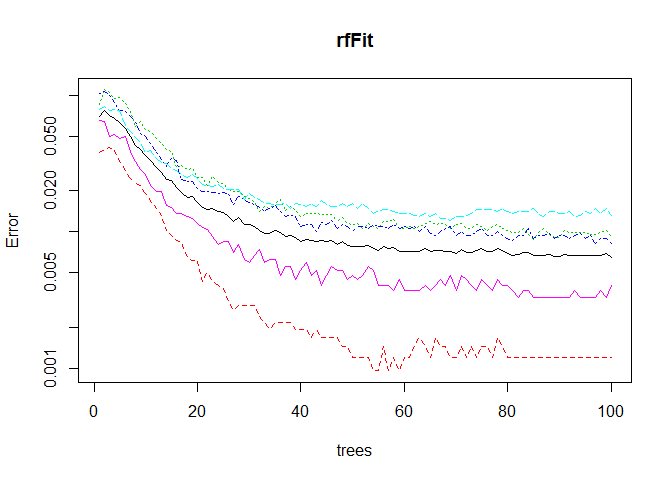
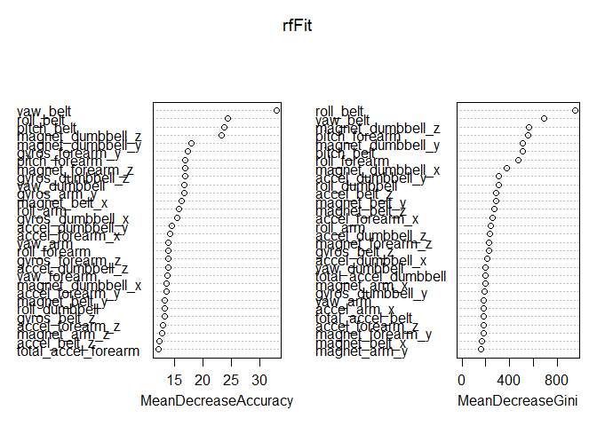

# Practical Machine Learning Peer Assessment: Prediction Assignment  
December 2014

## Background

Using devices such as Jawbone Up, Nike FuelBand, and Fitbit it is now possible to collect a large amount of data about personal activity relatively inexpensively. These type of devices are part of the quantified self movement – a group of enthusiasts who take measurements about themselves regularly to improve their health, to find patterns in their behavior, or because they are tech geeks. One thing that people regularly do is quantify how much of a particular activity they do, but they rarely quantify how well they do it. In this project, your goal will be to use data from accelerometers on the belt, forearm, arm, and dumbell of 6 participants. They were asked to perform barbell lifts correctly and incorrectly in 5 different ways. More information is available from the website here: http://groupware.les.inf.puc-rio.br/har (see the section on the Weight Lifting Exercise Dataset).


## Data Cleaning
First we need to get rid of the variables that have close to zero variance in both training and testing data. Then remove the columns with missing values to avoid issues in training models. If the result is not good, we can add back those columns with missing values imputed.

```r
#replaced "#DIV/0!"with an NA value 
training_data <- read.csv("pml-training.csv", na.strings=c("#DIV/0!") )
evaluation_data <- read.csv("pml-testing.csv", na.strings=c("#DIV/0!") )

#casted all columns 8 to the end to be numeric. 
for(i in c(8:ncol(training_data)-1)) {training_data[,i] = as.numeric(as.character(training_data[,i]))} 
for(i in c(8:ncol(evaluation_data)-1)) {evaluation_data[,i] = as.numeric(as.character(evaluation_data[,i]))}

#remove columns were mostly blank or unrlevant such as user name, timestamps and windows 
feature_set <- colnames(training_data[colSums(is.na(training_data)) == 0])[-(1:7)]
model_data <- training_data[feature_set]
feature_set
```

```
##  [1] "roll_belt"            "pitch_belt"           "yaw_belt"            
##  [4] "total_accel_belt"     "gyros_belt_x"         "gyros_belt_y"        
##  [7] "gyros_belt_z"         "accel_belt_x"         "accel_belt_y"        
## [10] "accel_belt_z"         "magnet_belt_x"        "magnet_belt_y"       
## [13] "magnet_belt_z"        "roll_arm"             "pitch_arm"           
## [16] "yaw_arm"              "total_accel_arm"      "gyros_arm_x"         
## [19] "gyros_arm_y"          "gyros_arm_z"          "accel_arm_x"         
## [22] "accel_arm_y"          "accel_arm_z"          "magnet_arm_x"        
## [25] "magnet_arm_y"         "magnet_arm_z"         "roll_dumbbell"       
## [28] "pitch_dumbbell"       "yaw_dumbbell"         "total_accel_dumbbell"
## [31] "gyros_dumbbell_x"     "gyros_dumbbell_y"     "gyros_dumbbell_z"    
## [34] "accel_dumbbell_x"     "accel_dumbbell_y"     "accel_dumbbell_z"    
## [37] "magnet_dumbbell_x"    "magnet_dumbbell_y"    "magnet_dumbbell_z"   
## [40] "roll_forearm"         "pitch_forearm"        "yaw_forearm"         
## [43] "total_accel_forearm"  "gyros_forearm_x"      "gyros_forearm_y"     
## [46] "gyros_forearm_z"      "accel_forearm_x"      "accel_forearm_y"     
## [49] "accel_forearm_z"      "magnet_forearm_x"     "magnet_forearm_y"    
## [52] "magnet_forearm_z"     "classe"
```

```r
#We now have the model data built from our feature set. 
idx <- createDataPartition(y=model_data$classe, p=0.75, list=FALSE )
training <- model_data[idx,]
testing <- model_data[-idx,]
```

## Build Random Forest Model
Lets fit a random forest and see how well it performs


```r
set.seed(2048)

rfFit=randomForest(classe~.,data=training,ntree=100, importance=TRUE)
rfFit
```

```
## 
## Call:
##  randomForest(formula = classe ~ ., data = training, ntree = 100,      importance = TRUE) 
##                Type of random forest: classification
##                      Number of trees: 100
## No. of variables tried at each split: 7
## 
##         OOB estimate of  error rate: 0.53%
## Confusion matrix:
##      A    B    C    D    E  class.error
## A 4182    3    0    0    0 0.0007168459
## B   16 2822    9    1    0 0.0091292135
## C    0   17 2543    7    0 0.0093494351
## D    0    0   18 2392    2 0.0082918740
## E    0    0    1    4 2701 0.0018477458
```

Provide error reports for both training and test data.

```r
predictions1 <- predict(rfFit, newdata=training)
confusionMatrix(predictions1,training$classe)
```

```
## Confusion Matrix and Statistics
## 
##           Reference
## Prediction    A    B    C    D    E
##          A 4185    0    0    0    0
##          B    0 2848    0    0    0
##          C    0    0 2567    0    0
##          D    0    0    0 2412    0
##          E    0    0    0    0 2706
## 
## Overall Statistics
##                                      
##                Accuracy : 1          
##                  95% CI : (0.9997, 1)
##     No Information Rate : 0.2843     
##     P-Value [Acc > NIR] : < 2.2e-16  
##                                      
##                   Kappa : 1          
##  Mcnemar's Test P-Value : NA         
## 
## Statistics by Class:
## 
##                      Class: A Class: B Class: C Class: D Class: E
## Sensitivity            1.0000   1.0000   1.0000   1.0000   1.0000
## Specificity            1.0000   1.0000   1.0000   1.0000   1.0000
## Pos Pred Value         1.0000   1.0000   1.0000   1.0000   1.0000
## Neg Pred Value         1.0000   1.0000   1.0000   1.0000   1.0000
## Prevalence             0.2843   0.1935   0.1744   0.1639   0.1839
## Detection Rate         0.2843   0.1935   0.1744   0.1639   0.1839
## Detection Prevalence   0.2843   0.1935   0.1744   0.1639   0.1839
## Balanced Accuracy      1.0000   1.0000   1.0000   1.0000   1.0000
```

```r
predictions2 <- predict(rfFit, newdata=testing)
confusionMatrix(predictions2,testing$classe)
```

```
## Confusion Matrix and Statistics
## 
##           Reference
## Prediction    A    B    C    D    E
##          A 1395    0    0    0    0
##          B    0  946    1    0    0
##          C    0    3  850    9    0
##          D    0    0    4  794    2
##          E    0    0    0    1  899
## 
## Overall Statistics
##                                           
##                Accuracy : 0.9959          
##                  95% CI : (0.9937, 0.9975)
##     No Information Rate : 0.2845          
##     P-Value [Acc > NIR] : < 2.2e-16       
##                                           
##                   Kappa : 0.9948          
##  Mcnemar's Test P-Value : NA              
## 
## Statistics by Class:
## 
##                      Class: A Class: B Class: C Class: D Class: E
## Sensitivity            1.0000   0.9968   0.9942   0.9876   0.9978
## Specificity            1.0000   0.9997   0.9970   0.9985   0.9998
## Pos Pred Value         1.0000   0.9989   0.9861   0.9925   0.9989
## Neg Pred Value         1.0000   0.9992   0.9988   0.9976   0.9995
## Prevalence             0.2845   0.1935   0.1743   0.1639   0.1837
## Detection Rate         0.2845   0.1929   0.1733   0.1619   0.1833
## Detection Prevalence   0.2845   0.1931   0.1758   0.1631   0.1835
## Balanced Accuracy      1.0000   0.9983   0.9956   0.9930   0.9988
```

```r
plot(rfFit, log="y")
```

 

```r
varImpPlot(rfFit,)
```

 

## Conclusions 

The confusion matrix shows that the model is very accurate.  I did experiment with cross validation, PCA and other models, but did not get as good of accuracy. Because my test data was around 99% 
accurate I expected nearly all of the submitted test cases to be correct.  It turned out they 
were all correct.

## Test Data Submit
Prepare the submission using COURSERA provided code as follows:


```r
pml_write_files = function(x){
  n = length(x)
  for(i in 1:n){
    filename = paste0("problem_id_",i,".txt")
    write.table(x[i],file=filename,quote=FALSE,row.names=FALSE,col.names=FALSE)
  }
}


x <- evaluation_data
x <- x[feature_set[feature_set!='classe']]
answers <- predict(rfFit, newdata=x)

answers
```

```
##  1  2  3  4  5  6  7  8  9 10 11 12 13 14 15 16 17 18 19 20 
##  B  A  B  A  A  E  D  B  A  A  B  C  B  A  E  E  A  B  B  B 
## Levels: A B C D E
```

```r
pml_write_files(answers)
```
